<div align="center">



<br/><br/>

<a href="https://franklinbugauisan.sanx.dev/">
  
</a>

# John Franklin C. Bugauisan
### Full-Stack Developer &amp; Applied AI Engineer

<p align="center">
  <b>Incorporator &amp; Lead Developer at <a href="https://franklinbugauisan.sanx.dev/">SanX</a></b> &nbsp;•&nbsp;
  <b>Backend AI &amp; Prompt Engineer at Flyrank</b> &nbsp;•&nbsp;
  <b>BS Computer Science (Data Mining)</b>
</p>

<p align="center">
  <a href="https://franklinbugauisan.sanx.dev/"></a>
  <a href="https://linkedin.com/in/johnfranklin-bugauisan"></a>
  <a href="mailto:johnfranklinbugauisan.dev@gmail.com"></a>
  <a href="https://github.com/ImFrankB"></a>
</p>

</div>

<br/>

---

### 💻 Engineering Identity

> *A deliberate path from problem to reliable product.*

I engineer across interfaces, backend APIs, data architectures, and applied AI to turn complex problems into robust, production-grade products — favoring proof-driven engineering, type safety, and verifiable retrieval pipelines over hype.

* 🎓 **Education:** BS Computer Science (Major in Data Mining), Isabela State University — Main Campus, Echague · *2023 – Expected 2027*
* 🏢 **Studio Leadership:** Incorporator & Lead Developer at **SanX** — architecting multi-platform products, cloud systems, and AI backends
* 💼 **Industry Experience:** Backend AI Engineer & Prompt Engineer at **Flyrank** · *June 2026 – Present*
* 🏆 **Recognition:** **1st Place / Champion, Most Innovative Project** — 16th ICT Roadshow, for *CampusTrace*
* 🥊 **Discipline:** Competitive boxing athlete — bringing the same endurance, precision, and focus to technical problem-solving

---

### 🌟 Featured Applications & Platforms

#### 🧠 [Learni](https://learni.site/) — AI-Powered Adaptive Learning Platform
> Transforms open-ended learning topics into tailored, measurable roadmaps with interactive conceptual quizzes and real-time progress analytics.

* 🌐 **Web Platform:** [learni.site](https://learni.site/)
* 📱 **Google Play Store:** [Download on Google Play](https://play.google.com/store/apps/details?id=site.learni.app&pcampaignid=web_share)
* 🛠️ **Stack:** `Next.js` · `React Native` · `TypeScript` · `AI APIs` · `Analytics`

<br/>

#### 🏆 [CampusTrace](https://campustrace.site/) — University Lost & Found Platform
> **1st Place / Champion — Most Innovative Project (16th ICT Roadshow)**  
> Campus-wide recovery network combining AI visual matching, semantic embeddings, and verifiable RAG search to reconnect students and staff with misplaced items.

* 🌐 **Live Platform:** [campustrace.site](https://campustrace.site/)
* 🛠️ **Stack:** `React` · `React Native` · `FastAPI` · `Agentic RAG` · `Vector Search`

<br/>

#### 💳 [Perako / PerakoPH](https://perako.sanx.dev/) — Financial Progressive Web Application
> Personal finance manager engineered with local-first offline storage, conflict resolution, automatic cloud sync, and AI transaction parsing.

* 🌐 **Live App:** [perako.sanx.dev](https://perako.sanx.dev/) &nbsp;·&nbsp; [Render Mirror](https://perako.onrender.com/)
* 🛠️ **Stack:** `PWA` · `Offline Sync` · `Supabase` · `Tailwind CSS`

<br/>

#### 📊 [Marka](https://marka.sanx.dev/) — ISU Academic GWA & Evaluation Tool
> Precision grade evaluation and projection system engineered around Isabela State University grading rubrics and curriculum standards.

* 🌐 **Live Tool:** [marka.sanx.dev](https://marka.sanx.dev/)
* 🛠️ **Stack:** `TypeScript` · `Client-Side Compute` · `Tailwind CSS`

<br/>

#### ⚡ Remie — AI-Powered Personal Productivity Assistant
> Unified multi-module assistant combining tasks, calendar scheduling, expense tracking, and natural-language episodic memory with local-first offline caching.

* 🛠️ **Stack:** `Agentic AI` · `Local Cache` · `LLM Memory` · `Fast Sync`

<br/>

#### 🔍 [Portfolio RAG Chatbot](https://franklinbugauisan.sanx.dev/) — Grounded AI Retrieval
> Vector-based RAG assistant embedded on my personal portfolio with semantic intent routing to answer technical questions about my projects and architecture choices.

* 🌐 **Live Assistant:** [franklinbugauisan.sanx.dev](https://franklinbugauisan.sanx.dev/)
* 🛠️ **Stack:** `Python` · `LangChain` · `Vector Search` · `Semantic Retrieval`

---

### 💼 Client Deliveries & Commercial Production

Production web systems and digital platforms engineered and shipped for international and local clients:

#### 🌍 International Client Delivery: [MikeMAThics](https://mikemathics.com/)
* **Category:** EdTech 1-on-1 Online Math Tutoring Platform & Student Booking Engine *(US Grades 3–12)*
* **Scope Delivered:** Full-stack online learning platform covering elementary arithmetic through AP Calculus. Architected a 5-stage automated booking journey: curriculum track matching, streamlined checkout & enrollment, personalized tutor matching, 12-session credit booking system, and student diagnostic tracking dashboards.
* 🔗 **Live Platform:** [mikemathics.com](https://mikemathics.com/)
* 🛠️ **Stack & Focus:** `Full-Stack Web` · `Booking Pipelines` · `Credit Management` · `Responsive UI`

<br/>

#### 🏢 Commercial B2B/B2C: [MR14 Consumer Goods Trading](https://www.mr14trading.com/)
* **Category:** Nationwide Sourcing & Product Distribution Platform
* **Scope Delivered:** Official commercial digital presence for a registered Philippine trading firm. Features a structured supply catalog across 5 major categories (Consumer Goods, Medical Supplies, Office Supplies, Industrial Supplies, Cleaning Products) serving government agencies, corporations, and healthcare facilities with a requirement-to-dispatch inquiry pipeline.
* 🔗 **Live Website:** [mr14trading.com](https://www.mr14trading.com/)
* 🛠️ **Stack & Focus:** `Corporate Architecture` · `Catalog System` · `B2B Inquiry Routing`

<br/>

#### 🎓 Institutional Education: [Odizee School of Achievers](https://www.odizeeschoolofachievers.site/)
* **Category:** Official K-12 Institutional School Portal & CMS
* **Scope Delivered:** Comprehensive web portal for a premier private K-12 educational institution in Alicia, Isabela (Founded 2007). Delivers academic track presentations (Kindergarten through Senior High School STEM, ABM, HUMSS, GAS), dynamic news/events publishing, campus gallery, and digital admissions contact funnel.
* 🔗 **Live Portal:** [odizeeschoolofachievers.site](https://www.odizeeschoolofachievers.site/)
* 🛠️ **Stack & Focus:** `Institutional Portal` · `Content Architecture` · `Admissions Funnel`

---

### 🛠️ Technical Stack & Capabilities

* **Product Interfaces (Web & Mobile):**  
  `React.js` &nbsp;·&nbsp; `Next.js` &nbsp;·&nbsp; `React Native` &nbsp;·&nbsp; `TypeScript` &nbsp;·&nbsp; `Tailwind CSS` &nbsp;·&nbsp; `Framer Motion`

* **Backend Systems & Data:**  
  `FastAPI` &nbsp;·&nbsp; `Node.js` &nbsp;·&nbsp; `Python` &nbsp;·&nbsp; `PostgreSQL` &nbsp;·&nbsp; `Supabase` &nbsp;·&nbsp; `MySQL` &nbsp;·&nbsp; `RESTful APIs`

* **Applied AI & Retrieval (RAG):**  
  `LangChain` &nbsp;·&nbsp; `LangGraph` &nbsp;·&nbsp; `Agentic RAG` &nbsp;·&nbsp; `Multi-Agent Systems` &nbsp;·&nbsp; `Vector Databases` &nbsp;·&nbsp; `Prompt Engineering`

* **DevOps, Delivery & Cloud:**  
  `Git` &nbsp;·&nbsp; `GitHub` &nbsp;·&nbsp; `Docker` &nbsp;·&nbsp; `Vercel` &nbsp;·&nbsp; `Render` &nbsp;·&nbsp; `Linux`

---

### 📜 Certifications & Accreditations

* 🏅 **Agentic AI with LangChain and LangGraph** — IBM / Coursera
* 🏅 **Claude Code: Software Engineering with AI Agents** — Vanderbilt University / Coursera
* 🏅 **AI and Applications** — HUAWEI ICT Academy
* 🏅 **Design Prompts for Everyday Work Tasks** — Google / Coursera
* 🏅 **Technical SEO and AI Search Essentials** — Semrush Academy

---

### ⚙️ Engineering Workflow

```text
[ 01. DEFINE ]  -->  Establish functional constraints, user pain points, and measurable outcomes.
[ 02. DESIGN ]  -->  Map relational schemas, API endpoints, state models, and component boundaries.
[ 03. BUILD  ]  -->  Implement modular, type-safe full-stack layers and grounded AI inference paths.
[ 04. VERIFY ]  -->  Validate edge handling, offline persistence, retrieval accuracy, and latency.
```

---

<div align="center">

<a href="https://github.com/ImFrankB">
  
</a>

<br/><br/>

<sub>Built with precision by <b>John Franklin C. Bugauisan</b></sub>

</div>
